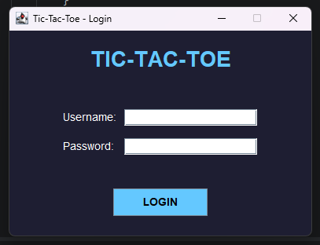
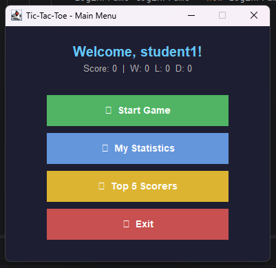
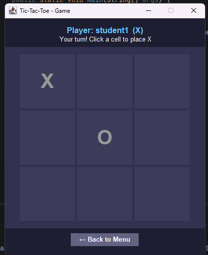
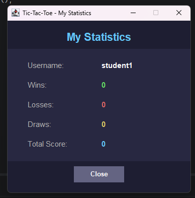
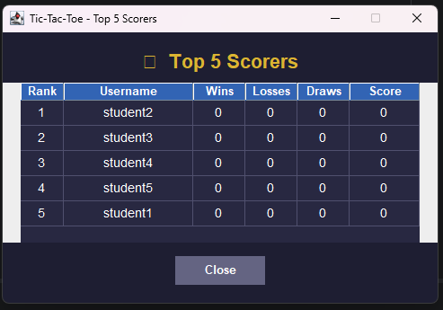

# Simple Tic-Tac-Toe Game with Java Swing, Login, and Statistics

## Student Information
Name       : Fauzta Athallah Nayottama
Student ID : 5026251130
Class      : A
---

## Project Description
This project is a simple Tic-Tac-Toe game built using **Java Swing GUI**.
The application includes login using a database, a playable Tic-Tac-Toe game against the computer,
game statistics recording, and a Top 5 Scorers leaderboard.

---

## Features
-  Login using PostgreSQL database (username & password check)
-  Play Tic-Tac-Toe using Java Swing GUI (3x3 board with JButton)
-  Computer AI (tries to win, blocks player, or picks random cell)
-  Record wins, losses, draws, and score after each game
-  Display personal statistics (My Statistics window)
-  Display Top 5 scorers using JTable (retrieved from database)

---

## Score Calculation
| Result | Score Change |
|--------|-------------|
| Win    | +10 points  |
| Draw   | +3 points   |
| Lose   | +0 points   |

---

## Database
- **Database used:** PostgreSQL
- **Table:** `players` (one table only)
- **Columns:** id, username, password, wins, losses, draws, score

---

## How to Run

### Step 1: Create the Database
1. Open pgAdmin or psql
2. Create a new database named `game_project`
3. Run the SQL file: `database/schema.sql`

### Step 2: Add JDBC Driver
1. Download `postgresql-XX.X.X.jar` from https://jdbc.postgresql.org/download/
2. In IntelliJ IDEA: `File → Project Structure → Libraries → + → Add JAR`
3. Select the downloaded `.jar` file

### Step 3: Configure Database Connection
Open `src/DatabaseManager.java` and update:
```java
private static final String URL      = "jdbc:postgresql://localhost:5433/game_project";
private static final String USER     = "postgres";   // your PostgreSQL username
private static final String PASSWORD = "5026251130";   // your PostgreSQL password
```

### Step 4: Run the Program
Run `src/Main.java`

### Default Login Credentials
| Username | Password |
|----------|----------|
| student1 | 12345    |
| student2 | 12345    |
| student3 | 12345    |
| student4 | 12345    |
| student5 | 12345    |

---

## Class Explanation

| Class | Responsibility |
|-------|---------------|
| `Main` | Entry point. Opens LoginFrame when program starts. |
| `DatabaseManager` | Handles JDBC connection to PostgreSQL. |
| `Player` | Model class. Stores player data: id, username, wins, losses, draws, score. |
| `PlayerService` | Service class. Handles login, update statistics, get top 5 scorers, refresh player data. |
| `GameLogic` | Handles all game rules: move validation, winner checking, draw checking, computer AI. |
| `LoginFrame` | Swing window for login. Calls PlayerService.login(). |
| `MainMenuFrame` | Swing window for main menu. Navigation to all features. |
| `GameFrame` | Swing window for playing the game. Connects buttons to GameLogic. |
| `StatisticsFrame` | Swing window showing personal statistics from database. |
| `TopScorersFrame` | Swing window showing Top 5 scorers using JTable from database. |

---

## Screenshots

### Login Window


### Main Menu


### Game Window


### Statistics


### Top 5 Scorers


---

## Links
- **GitHub:** [Your GitHub Repository URL]
- **YouTube:** [Your YouTube Video URL]
